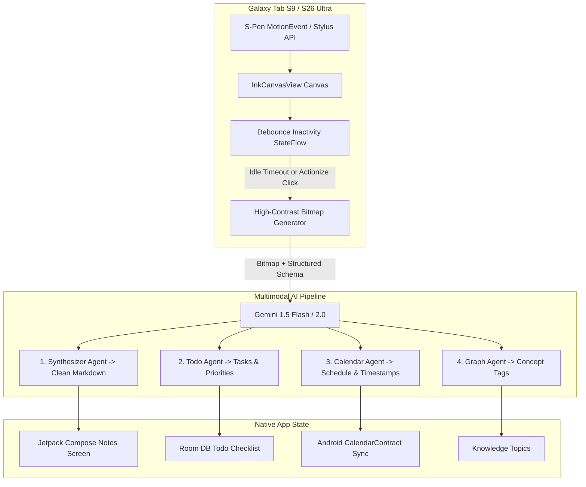

# 📱 InkAction (Android S-Pen AI)
### *Native Android App for Samsung Galaxy Tab S9 & Galaxy S26 Ultra*

*Write notes freely with your Samsung S-Pen. InkAction detects when you stop writing and deploys Google Gemini multimodal agents to synthesize clean Markdown notes, actionable Todo checklists (saved to Room DB), and syncs appointments directly to your Android Calendar.*

---

## 🌟 Why InkAction?

- **Zero Note Re-reading**: Never waste time trying to decipher messy handwritten ink or forgotten sketches again.
- **Hardware S-Pen & Stylus Integration**:
  - Pressure-sensitive ink engine (`MotionEvent.TOOL_TYPE_STYLUS`).
  - Native **Palm Rejection** (rejects accidental finger touches when stylus is near).
  - S-Pen barrel button click support for instant eraser switching.
- **"Done Writing" Auto-Push Engine**:
  - StateFlow countdown timer arms on stroke release (customizable: 4s, 6s, 8s, 12s).
  - Visual circular progress ring on screen.
  - Automatically sends bitmap snapshot to Google Gemini when idle.
- **Adaptive Samsung Galaxy Experience**:
  - **Dual-Pane Split View** on **Galaxy Tab S9** & Foldables.
  - **Tabbed Mobile Experience** on **Galaxy S26 Ultra**.
- **Android System Integration**:
  - **Room Database**: Offline persistence for all synthesized notes & todo checklists.
  - **Android Calendar Provider**: 1-click sync to Google Calendar / Samsung Calendar via `CalendarContract`.

---

## 🏛️ System Architecture

---

## 🚀 Getting Started with Android Studio

### Prerequisites
- **Android Studio Ladybug (2024.2+)** or newer.
- **JDK 17** or newer.
- **Samsung Galaxy Tab S9** or **Galaxy S26 Ultra** (or Android Emulator with stylus support).

### Setup & Run
1. Open Android Studio.
2. Select **File > Open** and choose the `InkAction` repository directory.
3. Allow Gradle to sync dependencies.
4. Run on your physical Galaxy device or emulator (`Shift + F10`).

---

## ⚙️ Configuration & API Key

1. Open the app and tap the **Settings** (⚙️) icon in the top app bar.
2. Enter your **Google Gemini API Key** (obtainable free at [ai.google.dev](https://ai.google.dev/)).
3. Select your model (`gemini-1.5-flash` or `gemini-2.0-flash`).
4. Set your inactivity debounce delay (e.g. 6 seconds).

> **Smart Demo Mode**: If you leave the API key empty, InkAction runs in built-in **Smart Demo Mode** so you can test the full S-Pen drawing, auto-push countdown, and UI flow immediately!

---

## 📚 Documentation

- [🤖 Multi-Agent Specifications (`AGENTS.md`)](AGENTS.md) — Multi-agent roles, system prompt directives, and schema models.
- [🏛️ Android Architecture (`ARCHITECTURE.md`)](ARCHITECTURE.md) — MotionEvent stylus interception, palm rejection heuristics, and Room DB schema.

---

## 📜 License

MIT License. Developed by [David](https://github.com/ForcePushDavid).
