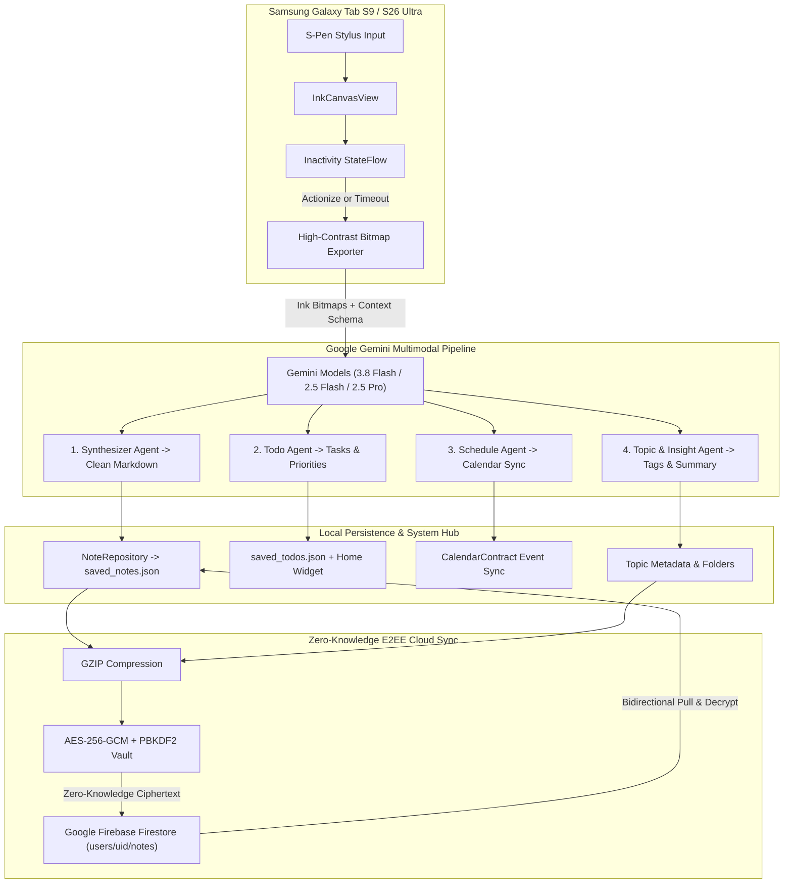

<div align="center">

# 📱 InkAction (Android S-Pen AI)
### *Next-Gen AI Workspace for Samsung Galaxy Tab S9 & Galaxy S26 Ultra*

[](https://github.com/ForcePushDavid/InkAction)
[](https://kotlinlang.org)
[](https://developer.android.com/jetpack/compose)
[](#)
[](#)
[](https://ai.google.dev/)
[](https://github.com/ForcePushDavid/InkAction/releases)

*Write thoughts freely with your Samsung S-Pen. InkAction senses when you pause and uses Google Gemini multimodal agents to synthesize clean Markdown notes, actionable Todo task checklists, and automatic calendar appointments.*

---

</div>

## 🌟 Key Features

- **Zero Note Re-reading**: Never struggle to decipher messy handwriting or forgotten sketches again.
- **🚀 High-Performance 120 FPS Ink Engine (Tablet Optimized)**:
  - **Viewport Frustum Culling**: Out of hundreds or thousands of strokes in long notes, only the strokes currently visible on screen are drawn. Eliminates stutter completely when writing long notes.
  - **Incremental $O(1)$ Bézier Curve Appending**: New points append curve segments in $O(1)$ time without rebuilding the entire path from point 0 on every touch event.
  - **Template Viewport Clipping**: Dots, lines, and grid templates only render within the visible screen bounds (reducing draw calls from 18,000+ to ~200 per frame).
  - **Fast Bounding-Box Stroke Eraser**: $O(1)$ AABB rejection and squared-distance point checks eliminate all square root calculations and GC pauses while erasing.
  - **GPU Memory Optimization**: Removed illegal 25,000px offscreen hardware layers (`setLayerType(LAYER_TYPE_HARDWARE, null)`), restoring full native GPU hardware-accelerated rendering.
  - **Isolated Recompositions**: Encapsulated the countdown button to eliminate full-canvas recompositions during timer ticks.
- **⚡ Responsive Auto-Actionize (6s Countdown & No Premature Drafts)**:
  - When you pause handwriting, a live countdown pill ticks down on the Actionize button (`Actionize (6s)`).
  - Automatically triggers Gemini multimodal synthesis after 6 seconds of inactivity (or customizable: 4s / 6s / 10s / 20s / Manual in Settings).
  - Writing resumes seamlessly without interruption (`onStrokeStarted` cancels and resets the countdown).
  - Eliminated premature "Draft Note" generation—drawings are preserved in high-fidelity vector format and transformed directly into AI notes.
- **☁️ Zero-Knowledge Cloud Sync (E2EE) with Automatic Differential Background Sync**:
  - **Automatic Continuous Sync**: Automatically syncs notes and drawings across Samsung Galaxy S26 Ultra (phone) and Galaxy Tab S9 (tablet) on app launch, app resume, tab switch, and note/todo mutations.
  - **Differential Sync Engine**: Compares cloud and local document timestamps to push/pull only notes that have changed, saving 95% bandwidth and completing in milliseconds.
  - **Top Bar Sync Status Indicator**: Real-time sync spinner, error alert, and manual 1-tap sync button directly in the top app bar.
  - **1-Click Google SSO & Email Auth**: Built-in Google Identity authentication with bundled Firebase backend—zero manual server setup required.
  - **AES-256-GCM Encryption**: All notes and raw stroke vectors are encrypted directly on-device with keys derived from a custom **Sync Passphrase** via PBKDF2 (100,000 iterations). Plaintext notes and Gemini API keys never touch the cloud.
  - **GZIP Stream Compression & Auto-Chunking**: Stroke coordinates are compressed with GZIP (reducing payload size by 90–95%) and automatically chunked into subcollections for giant drawings, completely eliminating Firestore's 1 MiB document limit.
  - **100% Offline Privacy Toggle**: A strict toggle completely disables cloud sync and network requests for users who prefer 100% local operation.
- **🖊️ Interactive Pen Stroke Thickness UX**:
  - Interactive tap-to-cycle stroke width on selected color bullet (`2.5f` Extra Fine, `4.0f` Fine, `6.5f` Medium, `10.0f` Bold).
  - Animated spring scaling and haptic feedback as you cycle thickness directly on the toolbar.
- **📱 Responsive Tablet UX & M3 Redesign**:
  - **Adaptive Navigation Rail**: Space-efficient 76 dp vertical rail on tablets preserving >90% drawing screen area.
  - **Dual-Pane Reference Panel**: Optional side-by-side view (70% full-screen canvas / 30% reference panel) in landscape.
  - **Material 3 Redesign**: Notes & Tasks tabs redesigned with capsule search bars, folder FilterChips, Todoist-style priority checkboxes, and ElevatedCards.
- **Hardware S-Pen & Stylus Optimization**:
  - Pressure-sensitive stylus engine (`MotionEvent.TOOL_TYPE_STYLUS`).
  - True **Hardware Palm Rejection** (ignores accidental finger touches when the stylus is in proximity).
  - S-Pen hardware barrel button support for instant eraser switching.
  - **Smart Stroke Eraser**: Remove entire lines/strokes with a single touch, just like in Samsung Notes.
- **"Done Writing" Auto-Push Engine**:
  - Automatically dispatches high-contrast bitmap snapshots to Google Gemini once you stop writing.
  - Non-intrusive status pill in the top bar with countdown and progress states.
- **Sharing & Export Options**:
  - Share format selection dialog: choose between high-res handwritten PNG image or clean formatted Markdown text.
  - PDF export and full ZIP backup / restore.
- **In-App Self-Updater**:
  - Direct GitHub Releases integration without requiring Google Play or Obtainium.
  - Automatic background check on launch, download progress reporting, and one-tap install.
- **Multilingual Support (i18n)**:
  - English, Czech (Čeština), and Dutch (Nederlands) with in-app language switching via `AppCompatDelegate`.
- **System Integration**:
  - **Atomic JSON Storage**: Thread-safe persistence using Kotlin Coroutine `Mutex` and atomic file renames.
  - **Android Calendar Sync**: 1-click event creation to Google Calendar / Samsung Calendar via `CalendarContract`.
  - **Desktop Widgets**: Interactive homescreen widget for immediate task overview and quick notes.
  - **Backup & Restore**: Instant ZIP archive export/import of all notes, todos, and raw S-Pen stroke files.

---

## 🏛️ System Architecture


```mermaid
flowchart TD
    subgraph Device [Samsung Galaxy Tab S9 / S26 Ultra]
        A[S-Pen Stylus Input] --> B[InkCanvasView]
        B --> C[Inactivity StateFlow]
        C -->|Actionize or Timeout| D[High-Contrast Bitmap Exporter]
    end

    subgraph AI [Google Gemini Multimodal Pipeline]
        D -->|Ink Bitmaps + Context Schema| E["Gemini Models (3.8 Flash / 2.5 Flash / 2.5 Pro)"]
        E --> F[1. Synthesizer Agent -> Clean Markdown]
        E --> G[2. Todo Agent -> Tasks & Priorities]
        E --> H[3. Schedule Agent -> Calendar Sync]
        E --> I[4. Topic & Insight Agent -> Tags & Summary]
    end

    subgraph Storage [Local Persistence & System Hub]
        F --> J[NoteRepository -> saved_notes.json]
        G --> K[saved_todos.json + Home Widget]
        H --> L[CalendarContract Event Sync]
        I --> M[Topic Metadata & Folders]
    end

    subgraph Cloud [Zero-Knowledge E2EE Cloud Sync]
        J & M --> N[GZIP Compression]
        N --> O[AES-256-GCM + PBKDF2 Vault]
        O -->|Zero-Knowledge Ciphertext| P["Google Firebase Firestore (users/uid/notes)"]
        P -->|Bidirectional Pull & Decrypt| J
    end
```

---

## 📱 Form Factors & Tablet UX

- **Phones (Galaxy S26 Ultra)**: Clean 4-tab bottom navigation (**Canvas / Notes / Tasks / Calendar**) with full-screen drawing canvas.
- **Tablets (Galaxy Tab S9 & Foldables)**:
  - **Full-screen drawing focus**: Plentiful A4-like workspace for freeform writing.
  - **Navigation Rail**: Space-efficient 72 dp side rail preserving >90% of screen width.
  - **Collapsible Reference Panel**: Optional side-by-side view (70% canvas / 30% past notes) for cross-referencing.

---

## 🚀 Getting Started

### Prerequisites
- **Android Studio Ladybug (2024.2+)** or newer.
- **JDK 17** (e.g. Amazon Corretto 17).
- Device with Android 10+ (API 29+) and stylus support (Galaxy Tab S9, S26 Ultra, etc.).

### Build & Run
```bash
git clone https://github.com/ForcePushDavid/InkAction.git
cd InkAction
./gradlew assembleDebug
```

---

## ⚙️ Configuration & API Key

1. Launch InkAction and tap the **⋮ Menu > Settings** (⚙️).
2. Enter your **Google Gemini API Key** (obtain free from [ai.google.dev](https://aistudio.google.com/)).
3. Select your active Gemini model (defaults to `gemini-3.8-flash`).
4. Optionally customize language, default event times, and notification reminders.

---

## 📚 Documentation

- [🤖 Multi-Agent Specifications (`AGENTS.md`)](AGENTS.md) — Multi-agent roles, system prompt directives, and schema models.
- [🏛️ Android Architecture (`ARCHITECTURE.md`)](ARCHITECTURE.md) — MotionEvent stylus interception, palm rejection heuristics, and data layer specifications.
- [📐 Tablet Redesign & Sync Plan (`TABLET_AND_SYNC_PLAN.md`)](TABLET_AND_SYNC_PLAN.md) — Architectural design for responsive tablet UX and Google account sync.

---

## 📜 License

MIT License. Developed by [David](https://github.com/ForcePushDavid).
